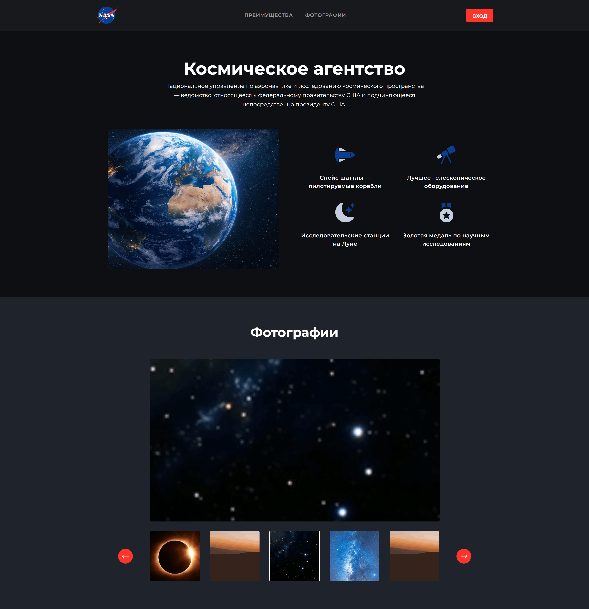
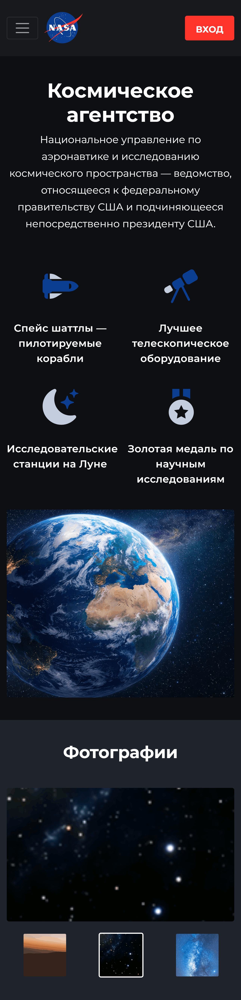

# Gallery Project 🖼️

Современное веб-приложение для создания фотогалерей с возможностью синхронизированного слайдера, построенное на Django и
Bootstrap 5.


---

## 📋 О проекте

Gallery Project - это полнофункциональная платформа для создания и управления фотогалереями. Проект разработан с учетом
современных требований к веб-приложениям и включает в себя удобную админ-панель для управления контентом.

---

### Основные возможности

- 🎨 Адаптивный дизайн на Bootstrap 5
- 🖱️ Синхронизированный слайдер на Slick Slider
- 🖼️ Просмотр изображений в полноэкранном режиме
- 📸 Управление фотографиями через Django Admin
- ✨ Drag & Drop сортировка изображений
- 🗄️ Работа с изображениями через django-filer
- 🌐 Поддержка MySQL

---

## 🚀 Демо проекта

<table>
  <tr>
    <th>Десктоп версия</th>
    <th>Мобильная версия</th>
  </tr>
  <tr>
    <td valign="top">
      
    </td>
    <td valign="top">
      
    </td>
  </tr>
</table>

_* Нажмите на изображение для увеличения_

## 🛠️ Технологии

- **Backend:** Python 3.12, Django 5.2
- **База данных:** MySQL
- **Frontend:** Bootstrap 5, Slick Slider, jQuery
- **Дополнительные пакеты:**
    - `django-filer` - управление файлами и изображениями
    - `django-admin-sortable2` - сортировка элементов в админке

---

## 📦 Установка

### Предварительные требования

- Python 3.12 или выше
- MySQL 8.0 или выше
- Git

### Пошаговая установка

1. **Клонируйте репозиторий**
    ```bash
    git clone https://github.com/shalbuz-cloud/gallery_project.git
    cd gallery_project
    ```

2. **Создайте виртуальное окружение**
    ```bash
    python -m venv venv
    source venv/bin/activate  # Для Linux/Mac
    # или
    venv\Scripts\activate  # Для Windows
    ```
   
3. **Установите зависимости**
    ```bash
    pip install -r req.pip
    ```

4. **Настройка базу данных**
    ```sql
    CREATE DATABASE gallery_db CHARACTER SET utf8mb4 COLLATE utf8mb4_unicode_ci;
    ```

5. **Настройка переменных окружения**

    ```bash
    # Создайте файл .env в корне проекта путем копирования (Linux / Mac):
    cp .env.example .env
    ```

    или создайте файл вручную .env в корне проекта:
    ```text
    # Django settings
    DEBUG=True
    SECRET_KEY=your-secret-key-here
    ALLOWED_HOSTS=localhost,127.0.0.1
    
    # Database settings
    DB_NAME=gallery_db
    DB_USER=root
    DB_PASSWORD=root
    DB_HOST=localhost
    DB_PORT=3306
    ```
    _Не забудьте подставить свои данные для подключения к БД_


6. **Выполните миграции и настройте проект**

    ```bash
    # Проверка конфигурации
    python manage.py check
    
    # Создание миграций
    python manage.py makemigrations
    
    # Применение миграций
    python manage.py migrate
    
    # Создание суперпользователя для доступа к админке
    python manage.py createsuperuser
    ```

7. **Запустите сервер разработки**

    ```bash
    python manage.py runserver
    ```

8. **Откройте приложение**

   - Сайт: http://127.0.0.1:8000/
   - Админ-панель: http://127.0.0.1:8000/admin/

---

## 📁 Структура проекта

```text
gallery_project/
├── apps/                       # Приложения проекта
│   └── gallery/                # Приложение галереи
│       ├── migrations/         # Миграции базы данных
│       ├── init.py
│       ├── admin.py            # Настройка админ-панели
│       ├── apps.py             # Конфигурация приложения
│       ├── models.py           # Модели данных
│       └── views.py            # Контроллеры
│
├── assets/                     # Исходники для сборки
│   ├── js/                     # JavaScript файлы
│   │   └── main.js
│   ├── scss/                   # SCSS файлы
│   │   └── main.scss
│   └── vendor/                 # Сторонние библиотеки
│
├── config/                     # Настройки проекта
│   ├── init.py
│   ├── asgi.py                 # ASGI конфигурация
│   ├── settings.py             # Настройки Django
│   ├── urls.py                 # Маршрутизация
│   └── wsgi.py                 # WSGI конфигурация
│
├── static/                     # Статические файлы (собранные)
│   ├── css/
│   ├── js/
│   └── images/
│
├── templates/                  # HTML шаблоны
│   └── gallery/
│   └── index.html              # Главная страница
│
├── manage.py                   # Управляющий скрипт Django
├── req.pip                     # Зависимости Python (pip)
├── pyproject.toml              # Зависимости Python (uv/poetry)
├── package.json                # Зависимости npm для разработки
└── .gitignore                  # Игнорируемые файлы Git
```

---

## 🎯 Использование

### Запуск проекта

```bash
# Запуск сервера разработки
python manage.py runserver

# Проверка подключения к базе данных
python manage.py check --database default

# Просмотр миграций
python manage.py showmigrations
```

### Управление через админ-панель

1. Добавление изображений в слайдер:
   - Перейдите в админ-панель (/admin)
   - В разделе "Слайдер" нажмите "Добавить изображение"
   - Загрузите изображение через django-filer
   - Укажите название и порядок сортировки

2. Сортировка изображений:
   - В списке изображений используйте Drag & Drop для изменения порядка
   - Изменения сохраняются автоматически

---

## 🔧 Дополнительные команды

```bash
# Сбор статических файлов
python manage.py collectstatic

# Создание дампа базы данных
python manage.py dumpdata > db_backup.json

# Восстановление из дампа
python manage.py loaddata db_backup.json
```

---

## 📊 Требования к проекту

- ✅ Bootstrap 5 для клиентской части
- ✅ Slick Slider с синхронизацией
- ✅ Полноэкранный просмотр фотографий
- ✅ Управление через Django Admin
- ✅ django-filer для загрузки изображений
- ✅ django-admin-sortable2 для сортировки
- ✅ Русскоязычный интерфейс админки
- ✅ MySQL база данных
- ✅ Зависимости в req.pip

---

## 🐛 Известные проблемы и их решение

- #### Проблема: Ошибка подключения к MySQL
> Решение: Проверьте настройки в .env и убедитесь, что MySQL сервер запущен

- #### Проблема: Не загружаются изображения через filer
> Решение: Проверьте права на запись в директории media/

---

## 📞 Контакты

**Автор проекта:** [shalbuz-cloud](https://github.com/shalbuz-cloud)

**Ссылки:**
- GitHub: [https://github.com/shalbuz-cloud](https://github.com/shalbuz-cloud)
- Репозиторий проекта: [https://github.com/shalbuz-cloud/gallery_project](https://github.com/shalbuz-cloud/gallery_project)

**Связаться со мной:**
- Telegram: [@shalbuz](https://t.me/shalbuz)
- Email: [shalbluz.mursalov@gmail.com](mailto:shalbluz.mursalov@gmail.com)

---

⭐️ Если вам понравился проект, не забудьте поставить звезду на GitHub!